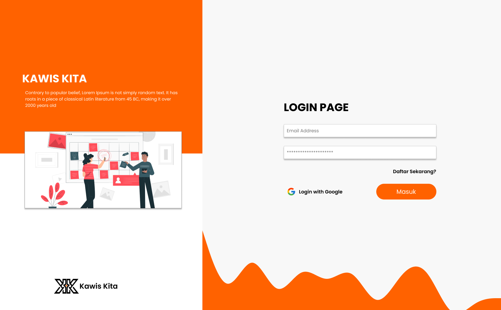

# 🗺️KawisKita Event Management App



A full-stack event management platform where users can view, search, and explore nearby events on an interactive map. Built with **Next.js**, **React**, **Prisma**, and **Mapbox GL JS**.

---

## 🚀 Features

- ✅ List public events with details (name, date, location, image)
- 📍 Display events on interactive **Mapbox map**
- 📡 Auto-detect user location & show **nearest events**
- 🔍 Search & filter events by distance
- 🌐 Responsive and modern UI with hover interactions
- 🔐 Authentication-ready (optional, via NextAuth.js)

---

## 🧱 Tech Stack

| Technology         | Description                         |
|-------------------|-------------------------------------|
| **Next.js**        | React Framework (frontend + backend)|
| **React**          | Frontend Library                    |
| **Mapbox GL JS**   | Interactive Maps                    |
| **Prisma**         | ORM for PostgreSQL/MySQL/SQLite     |
| **React Query**    | Data Fetching & Caching             |
| **TailwindCSS**    | Styling (Utility-First CSS)         |
| **NextAuth.js** (Optional) | Authentication             |

---

## 📦 Setup Instructions

### 1. Clone the Repository

```bash
git clone https://github.com/rahmatsuhadi/event-management-app.git
cd event-management-app
```

### 2. Install Dependencies

```bash
pnpm install
```

### 3. Configure Environment Variables

Create a `.env.local` file in the root directory and fill it with:

```env
NEXT_PUBLIC_SUPABASE_URL=https://your-project.supabase.co
NEXT_PUBLIC_SUPABASE_ANON_KEY=your-anon-key

DATABASE_URL=your-supabase-postgres-connection-pool
DIRECT_URL=your-direct-postgres-url

NEXTAUTH_SECRET=your_nextauth_secret

GOOGLE_CLIENT_ID=your_google_client_id
GOOGLE_CLIENT_SECRET=your_google_client_secret

NEXT_PUBLIC_MAPBOX_ACCESS_TOKEN=your_mapbox_token
NEXT_PUBLIC_MAPBOX_STYLE_URL=your_mapbox_style_url
```

### 4. Setup Prisma Database

```bash
npx prisma migrate dev --name init
npx prisma generate
```

### 5. Run Development Server

```bash
npm run dev
```

The application will be available at:  
👉 [http://localhost:3000](http://localhost:3000)

---

## 📁 Project Structure

```
/components
  /event
    ├── EventList.tsx        // List of events with details
    └── EventMap.tsx         // Mapbox map to display events

/pages
  /api
    └── events.ts           // API route for fetching event data
  /main/event/[id].tsx      // Dynamic route for event detail page

/lib
  └── prisma.ts             // Prisma client configuration

/hooks
  └── useGeolocation.ts     // Custom hook to detect user's location
```

---

## 📝 License

This project is licensed under the MIT License.

---

## 🤝 Contributing

Pull requests are welcome! For major changes, please open an issue first to discuss what you would like to change.

---

## 🙏 Acknowledgements

- [Mapbox](https://www.mapbox.com/)
- [Next.js](https://nextjs.org/)
- [Prisma](https://www.prisma.io/)
- [React Query](https://react-query.tanstack.com/)
- [TailwindCSS](https://tailwindcss.com/)
